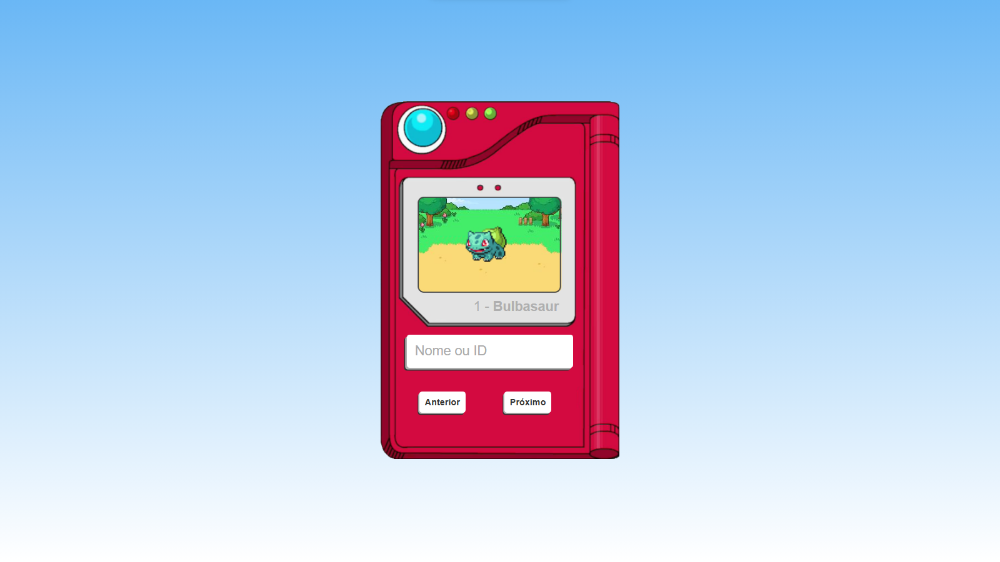

# Lista-de-Pokemons-com-API

Projeto pessoal para estudo de consumo de API's externas.

Por se tratar de um projeto mais antigo, utilizei de JavaScript Vanilla.\
Apesar disso, o resultado ficou bem performático e com uma UX (User Experience) e UI (User Interface) notávelmente agradável.